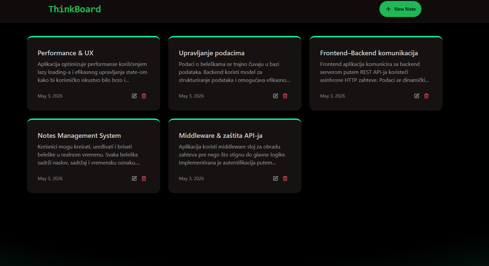

📝Thinkboard – Fullstack Note Taking App
Full-stack application for creating, updating, and deleting notes, built with React, Node.js, and MongoDB, featuring a RESTful API and responsive UI.

🛠️ Tech Stack
Frontend: React, Tailwind CSS
Backend: Node.js, Express
Database: MongoDB
Deployment: Vercel / Render / Railway

🔗 Live Demo: https://mern-thinkboard-yg2p.onrender.com/

Note: Initial load may take up to 30–60 seconds due to free hosting (Render server cold start).

